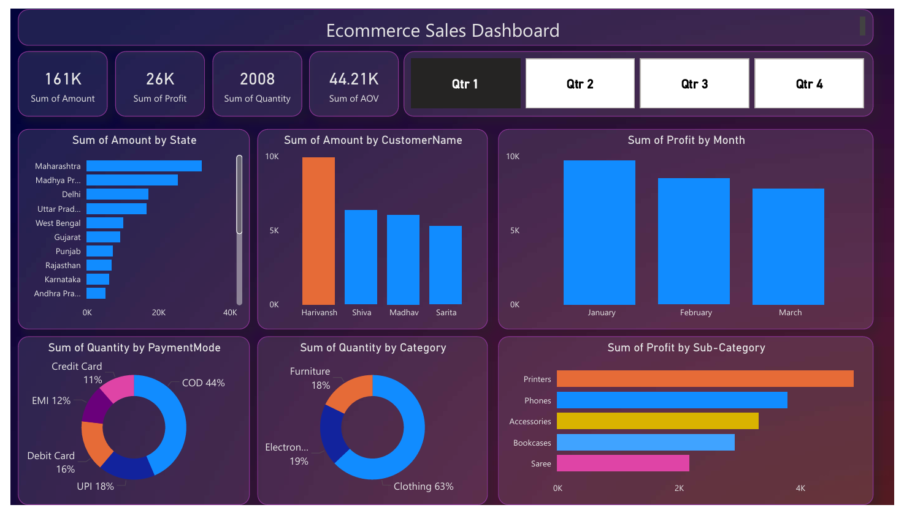

📊 Power BI Sales Dashboard

🔍 Project Overview
- This project is an interactive Power BI dashboard designed to analyze sales performance and business insights.
- The dashboard helps stakeholders understand sales trends, profit distribution, and key performance indicators (KPIs) through clear and interactive visualizations.

🎯 Objectives
- Analyze overall sales and profit performance
- Identify top-performing categories and state
- Track trends over time
- Enable decision-making using interactive filters and slicers

🛠 Tools & Technologies
- Power BI Desktop
- DAX (for calculated measures)
- Data Modeling
- Excel / CSV (data source)

📌 Key Features
- Interactive slicers for dynamic analysis
- KPI cards for quick insights
- Clean and user-friendly dashboard layout
- Optimized data model for performance

📸 Dashboard Preview

🚀 How to Use
- Download the Dashboard.pbix file
- Open it using Power BI Desktop
- Interact with slicers and visuals to explore insights

💡 Insights Generated
- Sales and profit trends across time
- High-performing product categories
- Region-wise contribution to revenue
- Data-driven business recommendations

📈 Future Improvements
- Add forecasting using time series
- Connect to a live database
- Enhance visuals with advanced DAX measures
